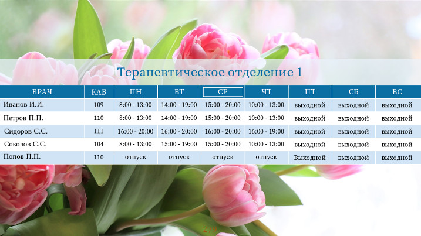

# Boo Schedule View README

This software broadcasts admission schedule of an office (primarily designed for polyclinic) by RTSP or HTTP as a sequence of pages. This enables showing the schedule by Smart-TV's connected to the local area network.

Software consists of two essential parts:

* Server which actually streams the video;

* Client - for managing the schedules.



## Details

Content of the schedule is stored in a MySQL (or MariaDB) database. The Boo Server acquires this information, groups it, splits by pages and forms pictures. How long each peace of information (a screenful) is being shown, color scheme, column titles of the schedule tables and other options could be set up by yourself.

The frames' succession is than being compressed, packed and delivered to the clients by multicast (supposing the network allows multicasting) if RTSP is used or by the help of a HTTP server. Gstreamer is used to compose, H264-encode and stream the video. H264 encoder runs with zerolatency quality which is not very good for movies but makes a good option for live-streaming and loads computer not very much. Default video resolution is 640x480 with framerate of 10 per second but it'll be fine to set resolution to greater values. Increasing framerate gives not much quality (since the video is mostly a static picture) but significally drops system perfomance.

Boo Client is a small and user-friendly GUI application which allows editing the schedules. The client may be (or should be) installed on a different computer than the server. Changes made by the client are available to the server on the next server's request to the database to generate an image of the page you have edited.

## Server Installation

No binary for the Boo Server is available, you have to compile it yourself.

### Building on Linux

To build the Boo Server on Linux you'll need GCC, cmake and development packages for:

* gstreamer, gstreamer-video, gstreamer-app, gstreamer-rtsp-server;

* freetype;

* mysqlclient (mariadb C connector as an alternative).

Use cmake to build booserver:
```
mkdir build
cmake -S /path/to/booserver/booserver -B build/
cmake --build build/
```

Server's binary would be located in build/bin/

### Building on Windows

Running the Boo Server on Windows is generally not a good idea but for development purpose.

For building the server on Windows better option is to use CodeLite IDE. Open the booserver.workspace file from within CodeLite and make booserver project active by double-clicking. You will probably need to change the paths to the libaries and include files:

* gstreamer and plugins;

* freetype;

* MYSQL Connector C 6.1.

Select build configuration Release and press F7 key to build the binary.

### Database Setup

1. Initialize the freshly installed DBMS if you haven't done this already:
```
/usr/bin/mysql_secure_installation
```

2. Log in and create database:
```
mysql -p
```
enter mysql superuser's password to log in and execute database creation script from the file:
```
source booserver.sql;
```

3. Create users and give them desired access to the newly created database (supposing you are within mysql client):
```
grant select on booserver.* to 'booserver_account'@'localhost' identified by 'server_password';
grant all privileges on booserver.* to 'client_name'@'%' identified by 'client_password';
```
where client_name, client_password, booserver_account and server_password should be chosen by yourself. Server's account should have read-only access to the database. Mind the @'localhost' when you create account for the server: it means the server will be able to connect to the database only from the same host. Client's account (or as many of them as you wish) is needed for the users to manage the schedule. They should be able to connect to the database remotly, which is enunciated by the pattern @'%' in user creation command.

4. Check database availability by both client and server users:
```
mysql -h [IP] -u client_name -p booserver
```
and
```
mysql -u booserver_account -p booserver
```


### Server Setup

On Linux host there should be installed the following packages: freetype, mysql (or mariadb), gstreamer, gstreamer-video, gstreamer-app, gstreamer-rtsp-server, gst-plugins-good, gst-plugins-bad, gst-plugins-ugly. The last one sounds awful but contains x264video codec which can't be helped.

Copy configuration files (booserver/\*.conf) and fonts (\*.ttf, \*.otf) to the same location as the binary. Change mysql connection parameters and network interface in booserver.conf in accordance to your need. You can change other options also.

Make sure the font you selected in the configuration file exists in the same directory as the server's binary.


### Starting Server

The server should be started from the directory it's located in. On Linux:

```
./booserver
```

On Windows the command should be something like:

```
booserver.exe --gst-root=C:\gstreamer\1.0\x86 --gst-plugin-path=C:\gstreamer\1.0\x86\lib\gstreamer-1.0
```

If everything is good server prints URL to connect to and waits for connections.


### Testing

Assuming you are testing on a computer from which the server is available by network. Start VLC Media Player and select "Media/Open URL..." (Ctrl+N). Enter the URL the booserver has shown you and click the play button. In a couple of seconds you should see the first page of the schedule.

If nothing is shown it is possible gstreamer failed to found some plugin. Try to stop booserver and run it with debug option to see what's wrong:

```
./booserver --gst-debug=1
```


### Running Server as a Service

There are several initialization systems on Linux. We'll discuss here OpenRC. It is used by [Alpine Linux](https://alpinelinux.org/) - great OS for server systems whichever service they should provide.

Supposing we have copied binary and configuration files of the server to /opt/booserver/. Now you have to create file /etc/init.d/booserver with this content:

```
#!/sbin/openrc-run

description="Schedule broadcasting by network for Smart-TVs"
command="/opt/booserver/$SVCNAME"
procname="$SVCNAME"
directory="/opt/booserver"
pidfile="/var/run/$SVCNAME.pid"
command_user="daemon"
command_background="yes"

depend() {
        use net
        use mariadb
}
```

Make this file executable:
```
chmod 755 booserver
```

Add the service to default runlevel:
```
rc-update add booserver default
```

Now run the server manually to check:
```
rc-service booserver start
```

That is all you need to run the service automatically!


#### Streaming by HTTP

Default configuration of Boo Server streams the video by RTSP. This setup is generally preferable but some client equipment likes RTSP not very much. I've got an evil experience with Samsung Smart-TV which offers but a limited number of players suitable for the task. Well, actually a single option: [OttPlayer](https://ottplayer.es/). Samsung platform failed to receive RTSP despite all my efforts but HTTP streaming it accepted rather good. So to the business.

HTTP streaming supposes existance of a web-server. In a certain directory of the web documents tree there is a bunch of video-stream chunks which are called like segment.0001.ts. And there is a playlist file with extension m3u8. Video-streaming server should refresh these chunks and the playlist in real time.

Again I engage [Alpine Linux](https://alpinelinux.org/). Apache is a heavy metal for the task of web-service in our case, so let's install [Tiny HTTPd](http://tinyhttpd.sourceforge.net/) and make it run on default runlevel:

```
apk add thttpd
rc-update add thttpd default
rc-service thttpd start
```

Document root directory in default installation is /var/www/http/ (see /etc/thttpd.conf). Let's store our streaming in /var/www/http/live/.

Edit the booserver.conf file changing these lines:

```
port=80
method=http
mount_point=/live/
playlist_location=/var/www/http/live/playlist.m3u8
segments_location=/var/www/http/live/segment.05%d.ts
```

Restart the Boo Server:

```
rc-service booserver restart
```

Everything should be working just fine, but we'll go further. Why should we stress our poor hard drive with constant rewriting playlist and segment files? Is it possible to store these files in memory? You're right! We'll just mount /var/www/http/live as a ramdisk!

```
rc-service thttpd stop
rc-service booserver stop
vi /etc/fstab
```

Add the following line:

```
ramfs  /var/www/live  ramfs rw,mode=777,nodev,nosuid,noexec,nodiratime,size=512M 0 0
```

Mind the mode parameter: it allows booserver writing to the mounted RAM volume. Now you can mount the ramdisk, start relevant services and launch fireworks:

```
mount /var/www/http/live
rc-service booserver start
rc-service thttpd start
```


## License
BSD 2-Clause License ([see here](LICENSE))


## Acknowledgments

I wish all the best to people who created wonderful tools and libraries I've been so happy to use:

* [GStreamer](https://gstreamer.freedesktop.org/)
* [wxWidgets](https://www.wxwidgets.org/)
* [Tiny HTTPd](http://tinyhttpd.sourceforge.net/)
* [The FreeType Project](https://www.freetype.org/)
* [MariaDB](https://mariadb.org/)
* [TDM-GCC](http://tdm-gcc.tdragon.net/)
* [GCC, the GNU Compiler Collection](https://gcc.gnu.org/)
* [CMake](https://cmake.org/)
* [CodeLite](https://codelite.org/)
* [wxFormBuilder](https://sourceforge.net/projects/wxformbuilder/)
* [Poedit](https://poedit.net/)
* [Alpine Linux](https://alpinelinux.org/)
* Many, many others - the list should be much longer indeed